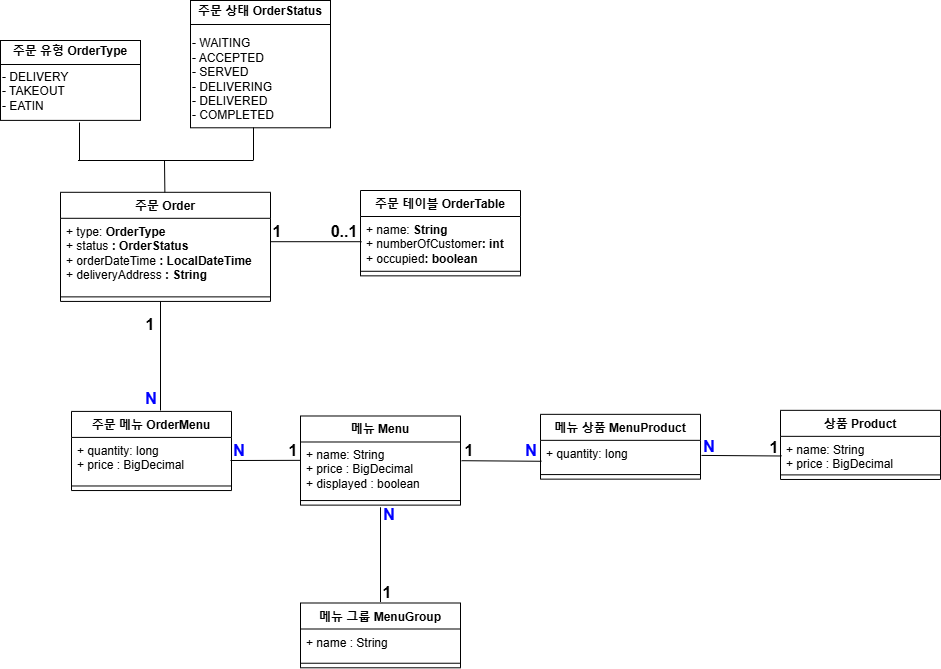

# 키친포스

## 퀵 스타트

```sh
cd docker
docker compose -p kitchenpos up -d
```

## 요구 사항

### 상품

- 상품을 등록할 수 있다.
- 상품의 가격이 올바르지 않으면 등록할 수 없다.
    - 상품의 가격은 0원 이상이어야 한다.
- 상품의 이름이 올바르지 않으면 등록할 수 없다.
    - 상품의 이름에는 비속어가 포함될 수 없다.
- 상품의 가격을 변경할 수 있다.
- 상품의 가격이 올바르지 않으면 변경할 수 없다.
    - 상품의 가격은 0원 이상이어야 한다.
- 상품의 가격이 변경될 때 메뉴의 가격이 메뉴에 속한 상품 금액의 합보다 크면 메뉴가 숨겨진다.
- 상품의 목록을 조회할 수 있다.

### 메뉴 그룹

- 메뉴 그룹을 등록할 수 있다.
- 메뉴 그룹의 이름이 올바르지 않으면 등록할 수 없다.
    - 메뉴 그룹의 이름은 비워 둘 수 없다.
- 메뉴 그룹의 목록을 조회할 수 있다.

### 메뉴

- 1 개 이상의 등록된 상품으로 메뉴를 등록할 수 있다.
- 상품이 없으면 등록할 수 없다.
- 메뉴에 속한 상품의 수량은 0 이상이어야 한다.
- 메뉴의 가격이 올바르지 않으면 등록할 수 없다.
    - 메뉴의 가격은 0원 이상이어야 한다.
- 메뉴에 속한 상품 금액의 합은 메뉴의 가격보다 크거나 같아야 한다.
- 메뉴는 특정 메뉴 그룹에 속해야 한다.
- 메뉴의 이름이 올바르지 않으면 등록할 수 없다.
    - 메뉴의 이름에는 비속어가 포함될 수 없다.
- 메뉴의 가격을 변경할 수 있다.
- 메뉴의 가격이 올바르지 않으면 변경할 수 없다.
    - 메뉴의 가격은 0원 이상이어야 한다.
- 메뉴에 속한 상품 금액의 합은 메뉴의 가격보다 크거나 같아야 한다.
- 메뉴를 노출할 수 있다.
- 메뉴의 가격이 메뉴에 속한 상품 금액의 합보다 높을 경우 메뉴를 노출할 수 없다.
- 메뉴를 숨길 수 있다.
- 메뉴의 목록을 조회할 수 있다.

### 주문 테이블

- 주문 테이블을 등록할 수 있다.
- 주문 테이블의 이름이 올바르지 않으면 등록할 수 없다.
    - 주문 테이블의 이름은 비워 둘 수 없다.
- 고객을 빈 테이블에 배정할 수 있다.
- 빈 테이블로 설정할 수 있다.
- 완료되지 않은 주문이 있는 주문 테이블은 빈 테이블로 설정할 수 없다.
- 방문한 고객 수를 변경할 수 있다.
- 방문한 고객 수가 올바르지 않으면 변경할 수 없다.
    - 방문한 고객 수는 0 이상이어야 한다.
- 빈 테이블은 방문한 고객 수를 변경할 수 없다.
- 주문 테이블의 목록을 조회할 수 있다.

### 주문

- 1개 이상의 등록된 메뉴로 배달 주문을 등록할 수 있다.
- 1개 이상의 등록된 메뉴로 포장 주문을 등록할 수 있다.
- 1개 이상의 등록된 메뉴로 매장 주문을 등록할 수 있다.
- 주문 유형이 올바르지 않으면 등록할 수 없다.
- 메뉴가 없으면 등록할 수 없다.
- 매장 주문은 주문 메뉴의 수량이 0 미만일 수 있다.
- 매장 주문을 제외한 주문의 경우 주문 메뉴의 수량은 0 이상이어야 한다.
- 배달 주소가 올바르지 않으면 배달 주문을 등록할 수 없다.
    - 배달 주소는 비워 둘 수 없다.
- 빈 테이블에는 매장 주문을 등록할 수 없다.
- 숨겨진 메뉴는 주문할 수 없다.
- 주문한 메뉴의 가격은 실제 메뉴 가격과 일치해야 한다.
- 주문을 접수한다.
- 접수 대기 중인 주문만 접수할 수 있다.
- 배달 주문을 접수되면 배달 대행사를 호출한다.
- 주문을 제공한다.
- 접수된 주문만 제공할 수 있다.
- 주문을 배달한다.
- 배달 주문만 배달할 수 있다.
- 제공된 주문만 배달할 수 있다.
- 주문을 배달 완료한다.
- 배달 중인 주문만 배달 완료할 수 있다.
- 주문을 완료한다.
- 배달 주문의 경우 배달 완료된 주문만 완료할 수 있다.
- 포장 및 매장 주문의 경우 제공된 주문만 완료할 수 있다.
- 주문 테이블의 모든 매장 주문이 완료되면 빈 테이블로 설정한다.
- 완료되지 않은 매장 주문이 있는 주문 테이블은 빈 테이블로 설정하지 않는다.
- 주문 목록을 조회할 수 있다.

## 용어 사전

### 공통 용어

| 한글명         | 영문명        | 설명                   |
|-------------|------------|----------------------|
| 비속어         | profanity  | 욕설 등 불쾌감과 모욕감을 주는 단어 |
| 비속어 필터링 시스템 | purgoMalum | 비속어를 감지하는 외부 시스템     |

### 고객

| 한글명 | 영문명      | 설명                                                                     |
|-----|----------|------------------------------------------------------------------------|
| 고객  | Customer | 메뉴 구매를 원하는 사람 <br/>고객은 메뉴 구매를 위해서 매장에 방문하여 식사 및 포장을 하거나 배달 요청을 할 수 있다. |

### 상품

| 한글명 | 영문명     | 설명                                             |
|-----|---------|------------------------------------------------|
| 상품  | Product | 메뉴에 포함되어 있는 개별 음식<br/> ex) 상품 : 새우버거, 감자튀김, 콜라 |

### 메뉴

| 한글명    | 영문명         | 설명                                                                           |
|--------|-------------|------------------------------------------------------------------------------|
| 메뉴     | Menu        | 1개 이상의 상품을 묶어서 고객에게 판매하는 단위 <br/> ex) 메뉴 : 새우버거 세트 <br/> 상품 : 새우버거, 감자튀김, 콜라 |
| 노출된 메뉴 | visibleMenu | 고객이 메뉴를 확인하고 구매할 수 있도록 노출된 상태의 메뉴                                            |
| 숨겨진 메뉴 | hiddenMenu  | 고객이 메뉴를 확인하지 못하도록 숨겨진 상태의 메뉴                                                 |

### 메뉴 상품

| 한글명      | 영문명         | 설명                              |
|----------|-------------|---------------------------------|
| 메뉴 상품    | menuProduct | 한 메뉴의 상품, 그리고 그 상품의 수량을 포함하는 개념 |
| 메뉴 상품 수량 | quantity    | 메뉴 상품의 수량                       |

### 메뉴 그룹

| 한글명   | 영문명       | 설명                                                                                          |
|-------|-----------|---------------------------------------------------------------------------------------------|
| 메뉴 그룹 | MenuGroup | 1개 이상의 메뉴를 묶어서 카테고리로 만든 것<br/> ex) 햄버거 : 새우버거, 치킨버거<br/> 사이드 : 감자튀김, 치즈스틱<br/> 음료 : 콜라, 사이다 |

### 주문

| 한글명    | 영문명           | 설명                                                                             |
|--------|---------------|--------------------------------------------------------------------------------|
| 주문     | order         | 고객이 메뉴를 구매하기 위해 매장에 요청하는 행위<br/> 주문은 주문 유형, 주문 메뉴, 주문 상태, 주문 생성 시간, 배달 주소를 가진다 |
| 주문 메뉴  | orderMenu     | 고객이 요청한 메뉴와 그 수량에 대한 내역                                                        |
| 배달 대행사 | deliveryAgent | 고객이 제공한 배달 주소와 주문 메뉴을 기반으로 배달을 담당하는 자                                          |

#### 주문 유형

| 한글명        | 영문명           | 설명                                                              |
|------------|---------------|-----------------------------------------------------------------|
| 주문 유형      | orderType     | 주문의 유형은 배달 주문, 포장 주문, 매장 내 식사 주문으로 이루어져 있다.                     |
| 배달 주문      | deliveryOrder | 고객이 배달을 요청하여 메뉴를 주문하는 경우<br/> 배달 주문의 경우, 주문에 배달 주소가 포함되어 있어야 한다 |
| 포장 주문      | takeOutOrder  | 고객이 포장을 요청하여 메뉴를 주문하는 경우                                        |
| 매장 내 식사 주문 | eatInOrder    | 매장을 방문한 고객이 매장 내에서 식사할 메뉴를 주문하는 경우                              |

#### 주문 상태

| 한글명         | 영문명             | 설명                                                                     |
|-------------|-----------------|------------------------------------------------------------------------|
| 주문 상태       | orderStatus     | 주문이 접수되고 처리되는 과정을 나타내는 상태                                              |
| 등록된 주문      | createdOrder    | 고객이 메뉴를 구매하기 위해 원하는 메뉴와 수량을 매장에 요청한 상태                                 |
| 접수 대기 중인 주문 | waitingOrder    | 등록된 주문을 매장에서 인지하지 못한 상태                                                |
| 접수된 주문      | acceptedOrder   | 매장에서 고객의 주문 메뉴을 확인한 후, 주문 메뉴의 메뉴들이 판매 가능하면 주문을 접수한 상태                  |
| 제공된 주문      | servedOrder     | 고객에게 주문 메뉴에 있는 메뉴를 제공한 상태<br/> 배달 주문의 경우, 배달주소와 주문메뉴을 배달대행사에게 메뉴를 제공한다 |
| 배달 중인 주문    | deliveringOrder | 배달 주문을 한 고객에게 배달을 시작한 상태                                               |
| 배달 완료된 주문   | deliveredOrder  | 배달 주문을 한 고객에게 배달을 완료한 상태                                               |
| 완료된 주문      | completedOrder  | 주문의 모든 처리가 끝난 상태                                                       |

#### 주문 테이블

| 한글명            | 영문명              | 설명                                                                          |
|----------------|------------------|-----------------------------------------------------------------------------|
| 주문 테이블         | orderTable       | 매장 내 식사 주문을 요청하는 고객을 위해 설치한 테이블<br/> 테이블에 앉은 고객 수와 해당 테이블에서 요청된 주문 정보를 관리한다 |
| 주문 테이블 인원 수    | numberOfCustomer | 주문 테이블에 앉은 고객의 수                                                            |
| 주문 테이블 배정가능 여부 | occupied         | 주문 테이블을 사용할 수 있는지 여부                                                        |
| 빈 테이블          | clearedTable     | 고객이 없는 주문 테이블                                                               |
| 고객이 배정된 테이블    | assignedTable    | 고객이 배정된 테이블이며, 고객 배정 이후 주문을 등록할 수 있다                                        |

## 모델링

### 객체 기반 모델링



### Product

- `Product`는 이름과, 가격을 가지고 있다.
- `Product`는 이름과 가격을 입력하여 등록 가능하다
  - 등록 정책
    - 이름과 가격은 반드시 입력되어야 한다
    - 이름은 비속어가 포함될 수 없다
    - 가격은 0원 이상이어야 한다
- `Product`의 가격을 변경할 수 있다
  - 가격 수정 정책
    - 가격은 0원 이상이어야 한다
  - `Menu` 가격이 `Menu`가 속한 `Product`가격 총합보다 크면 `hiddenMenu`가 된다
- `Product` 목록을 조회할 수 있다

### MenuGroup

- `MenuGroup`은 이름을 가지고 있다
- `MenuGroup`을 이름을 입력하여 등록할 수 있다
  - 정책
    - 이름은 공백만 입력할 수 없으며 반드시 입력되어야 한다
- `MenuGroup` 목록을 조회할 수 있다

### Menu

- `Menu`는 이름, 가격, `MenuGroup`, 메뉴 노출 여부룰 가지고 있다
- `Menu`를 등록할 수 있다
  - 이름, 가격, `MenuGroup`, 메뉴 노출 여부를 입력하여 등록한다
  - 정책
    - `Menu`는 1개 이상의 `Product`로 구성되어야 한다
    - `Menu`를 구성하는 `Product`의 수량은 0이상이어야 한다
    - 이름과 가격, `MenuGroup`은 반드시 입력되어야 한다
    - 이름은 비속어가 포함될 수 없다
    - 가격은 0원 이상이어야 한다
    - `Menu`가격은 `Menu`가 속한 `Product`가격 총합 이하여야 한다
- `Menu`의 가격을 변경할 수 있다
  - 정책
    - 가격은 반드시 입력되어야 하며 0원 이상이어야 한다
    - `Menu`가격은 `Menu`가 속한 `Product`가격 총합 이하여야 한다

- `visibleMenu`가 된다
  - 메뉴 노출 여부를 true로 변경하여 `visibleMenu`로 만든다
  - 정책
    - `Menu`가격은 `Menu`가 속한 `Product`가격 총합 이하여야 한다

- `hiddenMenu`가 된다
  - 메뉴 노출 여부를 false로 변경하여 `hiddenMenu`로 만든다

- `Menu`의 목록을 조회할 수 있다

### OrderTable

- `OrderTable`은 이름, `numberOfCustomer`, 고객이 배정된 테이블인지 여부를 가지고 있다
- `OrderTable`의 이름을 입력하여 등록할 수 있다
  - `numberOfCustomer`을 0으로 등록한다
  - 고객이 배정된 테이블인지 여부를 false로 등록한다
  - 정책
    - 이름은 공백만 입력할 수 없으며 반드시 입력되어야 한다
- `OrderTable`이 `assignedTable`로 된다
  - 고객이 배정된 테이블인지 여부가 true로 변경된다
- `OrderTable`이 `clearedTable`로 된다
  - `numberOfCustomer`을 0으로 변경한다
  - 고객이 배정된 테이블인지 여부를 false로 변경한다
  - 정책
    - 완료되지 않은 주문이 있는 `OrderTable`은 `clearedTable`가 될 수 없다
- `numberOfCustomer`를 변경할 수 있다
  - 정책
    - 음수로는 변경할 수 없다
    - `clearedTable`이면 변경할 수 없다
- `OrderTable` 목록을 조회할 수 있다

### Order

#### `orderType`에 따른 `orderStatus` 변화


- `Order`를 등록한다
  - 1개 이상의 `visibleMenu`로 주문 등록할 수 있다
  - 공통 정책
    - `orderType`이 `deliveryOrder`, `takeOutOrder`, `eatInOrder` 중 하나여야 한다
    - 1개 이상의 `orderMenu`이 있어야 한다
    - `hiddenMenu`는 주문 등록할 수 없다
    - `orderMenu` 목록에 속한 `Menu`가격은 실제 `Menu`가 가격과 동일해야 한다

  - `deliveryOrder` 등록 정책
    - `orderMenu`의 수량은 0이상이어야 한다
    - 배달 주소는 공백만 입력할 수 없으며 반드시 입력되어야 한다

  - `takeOutOrder` 등록 정책
    - `orderMenu`의 수량은 0이상이어야 한다

  - `eatInOrder` 등록 정책
    - `clearedTable`면 등록할 수 없다

  - `Order`가 정상적으로 등록되면 `waitingOrder`가 된다

- `Order`가 `acceptedOrder`가 된다
  - 정책
    - `waitingOrder`인 경우만 가능하다
  - `deliveryOrder`는 `deliveryAgent`에게 `orderMenu`목록에 속한 `Menu` 가격의 총합, 배달 주소를 전달한다

- `Order`가 `servedOrder`가 된다
  - 정책
    - `acceptedOrder`인 경우만 가능하다

- `Order`가 `deliveringOrder`가 된다
  - 정책
    - `orderType`이 `deliveryOrder`여야 한다
    - `servedOrder`인 경우만 가능하다

- `Order`가 `deliveredOrder`가 된다
  - 정책
    - `deliveringOrder`인 경우만 가능하다

- `Order`가 `completedOrder`가 된다
  - 정책
    - `deliveryOrder`는 `deliveredOrder`여야 한다
    - `takeOutOrder`, `eatInOrder`는 `servedOrder`여야 한다
  - `eatInOrder`의 경우, `OrderTable`에 속한 `Order`의 `orderStatus`가 `completedOrder`일 때 `clearedTable`로 만든다
    - `numberOfCustomer`을 0으로 변경한다
    - 고객이 배정된 테이블인지 여부를 true로 변경한다

- `Order` 목록을 조회할 수 있다
