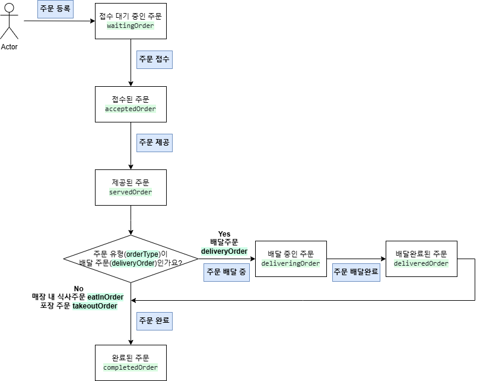

# 키친포스

## 퀵 스타트

```sh
cd docker
docker compose -p kitchenpos up -d
```

## 요구 사항

### 상품

- 상품을 등록할 수 있다.
- 상품의 가격이 올바르지 않으면 등록할 수 없다.
    - 상품의 가격은 0원 이상이어야 한다.
- 상품의 이름이 올바르지 않으면 등록할 수 없다.
    - 상품의 이름에는 비속어가 포함될 수 없다.
- 상품의 가격을 변경할 수 있다.
- 상품의 가격이 올바르지 않으면 변경할 수 없다.
    - 상품의 가격은 0원 이상이어야 한다.
- 상품의 가격이 변경될 때 메뉴의 가격이 메뉴에 속한 상품 금액의 합보다 크면 메뉴가 숨겨진다.
- 상품의 목록을 조회할 수 있다.

### 메뉴 그룹

- 메뉴 그룹을 등록할 수 있다.
- 메뉴 그룹의 이름이 올바르지 않으면 등록할 수 없다.
    - 메뉴 그룹의 이름은 비워 둘 수 없다.
- 메뉴 그룹의 목록을 조회할 수 있다.

### 메뉴

- 1 개 이상의 등록된 상품으로 메뉴를 등록할 수 있다.
- 상품이 없으면 등록할 수 없다.
- 메뉴에 속한 상품의 수량은 0 이상이어야 한다.
- 메뉴의 가격이 올바르지 않으면 등록할 수 없다.
    - 메뉴의 가격은 0원 이상이어야 한다.
- 메뉴에 속한 상품 금액의 합은 메뉴의 가격보다 크거나 같아야 한다.
- 메뉴는 특정 메뉴 그룹에 속해야 한다.
- 메뉴의 이름이 올바르지 않으면 등록할 수 없다.
    - 메뉴의 이름에는 비속어가 포함될 수 없다.
- 메뉴의 가격을 변경할 수 있다.
- 메뉴의 가격이 올바르지 않으면 변경할 수 없다.
    - 메뉴의 가격은 0원 이상이어야 한다.
- 메뉴에 속한 상품 금액의 합은 메뉴의 가격보다 크거나 같아야 한다.
- 메뉴를 노출할 수 있다.
- 메뉴의 가격이 메뉴에 속한 상품 금액의 합보다 높을 경우 메뉴를 노출할 수 없다.
- 메뉴를 숨길 수 있다.
- 메뉴의 목록을 조회할 수 있다.

### 주문 테이블

- 주문 테이블을 등록할 수 있다.
- 주문 테이블의 이름이 올바르지 않으면 등록할 수 없다.
    - 주문 테이블의 이름은 비워 둘 수 없다.
- 고객을 빈 테이블에 배정할 수 있다.
- 빈 테이블로 설정할 수 있다.
- 완료되지 않은 주문이 있는 주문 테이블은 빈 테이블로 설정할 수 없다.
- 방문한 고객 수를 변경할 수 있다.
- 방문한 고객 수가 올바르지 않으면 변경할 수 없다.
    - 방문한 고객 수는 0 이상이어야 한다.
- 빈 테이블은 방문한 고객 수를 변경할 수 없다.
- 주문 테이블의 목록을 조회할 수 있다.

### 주문

- 1개 이상의 등록된 메뉴로 배달 주문을 등록할 수 있다.
- 1개 이상의 등록된 메뉴로 포장 주문을 등록할 수 있다.
- 1개 이상의 등록된 메뉴로 매장 주문을 등록할 수 있다.
- 주문 유형이 올바르지 않으면 등록할 수 없다.
- 메뉴가 없으면 등록할 수 없다.
- 매장 주문은 주문 항목의 수량이 0 미만일 수 있다.
- 매장 주문을 제외한 주문의 경우 주문 항목의 수량은 0 이상이어야 한다.
- 배달 주소가 올바르지 않으면 배달 주문을 등록할 수 없다.
    - 배달 주소는 비워 둘 수 없다.
- 빈 테이블에는 매장 주문을 등록할 수 없다.
- 숨겨진 메뉴는 주문할 수 없다.
- 주문한 메뉴의 가격은 실제 메뉴 가격과 일치해야 한다.
- 주문을 접수한다.
- 접수 대기 중인 주문만 접수할 수 있다.
- 배달 주문을 접수되면 배달 대행사를 호출한다.
- 주문을 제공한다.
- 접수된 주문만 제공할 수 있다.
- 주문을 배달한다.
- 배달 주문만 배달할 수 있다.
- 제공된 주문만 배달할 수 있다.
- 주문을 배달 완료한다.
- 배달 중인 주문만 배달 완료할 수 있다.
- 주문을 완료한다.
- 배달 주문의 경우 배달 완료된 주문만 완료할 수 있다.
- 포장 및 매장 주문의 경우 제공된 주문만 완료할 수 있다.
- 주문 테이블의 모든 매장 주문이 완료되면 빈 테이블로 설정한다.
- 완료되지 않은 매장 주문이 있는 주문 테이블은 빈 테이블로 설정하지 않는다.
- 주문 목록을 조회할 수 있다.

## 용어 사전

### 공통 용어

| 한글명        | 영문명               | 설명                   |
|------------|-------------------|----------------------|
| 비속어        | profanity         | 욕설 등 불쾌감과 모욕감을 주는 단어 |
| 비속어 감지 시스템 | ProfanityDetector | 비속어를 감지하는 시스템        |

### 1. 상품

| 한글명  | 영문명         | 설명                                             |
|------|-------------|------------------------------------------------|
| 상품   | Product     | 메뉴에 포함되어 있는 개별 음식<br/> ex) 상품 : 새우버거, 감자튀김, 콜라 |
| 상품명  | ProductName | 상품의 명칭                                         |
| 상품가격 | Price       | 상품의 가격                                         |

### 2. 메뉴

| 한글명      | 영문명         | 설명                                                                           |
|----------|-------------|------------------------------------------------------------------------------|
| 메뉴       | Menu        | 1개 이상의 상품을 묶어서 고객에게 판매하는 단위 <br/> ex) 메뉴 : 새우버거 세트 <br/> 상품 : 새우버거, 감자튀김, 콜라 |
| 메뉴명      | MenuName    | 메뉴의 명칭                                                                       |
| 메뉴 가격    | Price       | 메뉴의 가격                                                                       |
| 메뉴 노출 여부 | displayed   | 메뉴가 노출되었는지(true)/ 메뉴가 숨겨져있는지(false)를 나타내는 여부                                 |
| 노출된 메뉴   | visibleMenu | 고객이 메뉴를 확인하고 구매할 수 있도록 노출된 상태의 메뉴                                            |
| 숨겨진 메뉴   | hiddenMenu  | 고객이 메뉴를 확인하지 못하도록 숨겨진 상태의 메뉴                                                 |

### 2-1. 메뉴 상품

| 한글명      | 영문명                   | 설명                             |
|----------|-----------------------|--------------------------------|
| 메뉴상품     | MenuProduct           | 메뉴를 구성하는 상품과 각 상품의 수량을 관리하는 항목 |
| 메뉴 상품 수량 | quantity              | 메뉴를 구성하는 상품의 수량                |
| 메뉴 상품 총합 | totalMenuProductPrice | 메뉴를 구성하는 상품의 가격 총합             |

### 3. 메뉴 그룹

| 한글명   | 영문명           | 설명                                                                                          |
|-------|---------------|---------------------------------------------------------------------------------------------|
| 메뉴 그룹 | MenuGroup     | 1개 이상의 메뉴를 묶어서 카테고리로 만든 것<br/> ex) 햄버거 : 새우버거, 치킨버거<br/> 사이드 : 감자튀김, 치즈스틱<br/> 음료 : 콜라, 사이다 |
| 메뉴그룹명 | MenuGroupName | 메뉴 그룹의 명칭                                                                                   |

### 4. 고객

| 한글명 | 영문명      | 설명                                                                     |
|-----|----------|------------------------------------------------------------------------|
| 고객  | Customer | 메뉴 구매를 원하는 사람 <br/>고객은 메뉴 구매를 위해서 매장에 방문하여 식사 및 포장을 하거나 배달 요청을 할 수 있다. |

### 5. 주문

| 한글명      | 영문명             | 설명                                                                             |
|----------|-----------------|--------------------------------------------------------------------------------|
| 주문       | Order           | 고객이 메뉴를 구매하기 위해 매장에 요청하는 행위<br/> 주문은 주문 유형, 주문 항목, 주문 상태, 주문 생성 시간, 배달 주소를 가진다 |
| 주문 등록 시간 | orderDateTime   | 주문이 최초 등록된 시간                                                                  |
| 배달 주소    | deliveryAddress | 배달 주문 시, 고객에게 배달될 주소                                                           |
| 배달 대행사   | DeliveryAgent   | 고객이 제공한 배달 주소와 주문 항목을 기반으로 배달을 담당하는 자                                          |

#### 5-1 주문 항목

| 한글명        | 영문명             | 설명                      |
|------------|-----------------|-------------------------|
| 주문 항목      | OrderLineItem   | 고객이 주문한 메뉴와 그 수량에 대한 내역 |
| 주문한 메뉴의 수량 | quantity        | 고객이 주문한 메뉴의 수량          |
| 주문한 메뉴의 가격 | Price           | 고객이 주문한 메뉴의 가격          |
| 총주문금액      | totalOrderPrice | 고객이 주문한 메뉴의 가격 총 합      |

#### 5-2 주문 유형

| 한글명        | 영문명           | 설명                                                              |
|------------|---------------|-----------------------------------------------------------------|
| 주문 유형      | OrderType     | 주문의 유형은 배달 주문, 포장 주문, 매장 내 식사 주문으로 이루어져 있다.                     |
| 배달 주문      | deliveryOrder | 고객이 배달을 요청하여 메뉴를 주문하는 경우<br/> 배달 주문의 경우, 주문에 배달 주소가 포함되어 있어야 한다 |
| 포장 주문      | takeOutOrder  | 고객이 포장을 요청하여 메뉴를 주문하는 경우                                        |
| 매장 내 식사 주문 | eatInOrder    | 매장을 방문한 고객이 매장 내에서 식사할 메뉴를 주문하는 경우                              |

#### 5-3 주문 상태

| 한글명         | 영문명             | 설명                                                                     |
|-------------|-----------------|------------------------------------------------------------------------|
| 주문 상태       | OrderStatus     | 주문이 접수되고 처리되는 과정을 나타내는 상태                                              |
| 등록된 주문      | createdOrder    | 고객이 메뉴를 구매하기 위해 원하는 메뉴와 수량을 매장에 요청한 상태                                 |
| 접수 대기 중인 주문 | waitingOrder    | 등록된 주문을 매장에서 인지하지 못한 상태                                                |
| 접수된 주문      | acceptedOrder   | 매장에서 고객의 주문 항목을 확인한 후, 주문 항목의 메뉴들이 판매 가능하면 주문을 접수한 상태                  |
| 제공된 주문      | servedOrder     | 고객에게 주문 항목에 있는 메뉴를 제공한 상태<br/> 배달 주문의 경우, 배달주소와 주문항목을 배달대행사에게 메뉴를 제공한다 |
| 배달 중인 주문    | deliveringOrder | 배달 주문을 한 고객에게 배달을 시작한 상태                                               |
| 배달 완료된 주문   | deliveredOrder  | 배달 주문을 한 고객에게 배달을 완료한 상태                                               |
| 완료된 주문      | completedOrder  | 주문의 모든 처리가 끝난 상태                                                       |

#### 5-4 주문 테이블

| 한글명         | 영문명               | 설명                                                                          |
|-------------|-------------------|-----------------------------------------------------------------------------|
| 주문 테이블      | OrderTable        | 매장 내 식사 주문을 요청하는 고객을 위해 설치한 테이블<br/> 테이블에 앉은 고객 수와 해당 테이블에서 요청된 주문 정보를 관리한다 |
| 주문 테이블명     | OrderTableName    | 주문 테이블의 명칭                                                                  |
| 방문한 고객 수    | numberOfCustomer  | 주문 테이블에 앉은 고객의 수                                                            |
| 고객 배정 유무    | occupied          | 주문 테이블에 고객이 배정되었는지(true) / 배정되지 않았는지(false)를 나타내는 여부                        |
| 빈 테이블       | clearedTable      | 고객이 없는 주문 테이블                                                               |
| 고객이 배정된 테이블 | assignedTable     | 고객이 배정된 테이블이며, 고객 배정 이후 주문을 등록할 수 있다                                        |
| 미완료 주문 테이블  | pendingOrderTable | 완료되지 않은 주문이 있는 주문 테이블                                                       |

## 모델링

### 객체 기반 모델링


### Product

- `Product`는 `ProductName`, `Price`를 가지고 있다.
- `Product`는 `ProductName`와 `Price`를 입력하여 등록 가능하다
    - 등록 정책
        - `ProductName`과 `Price`은 반드시 입력되어야 한다
        - `ProductName`은 `profanity`가 포함될 수 없다
            - `ProfanityDetector`을 사용하여 올바른 `ProductName`인지 확인한다
        - `Price`은 0원 이상이어야 한다
- `Product`의 `Price`를 변경할 수 있다
    - `Price` 변경 정책
        - `Price`는 0원 이상이어야 한다
    - `Menu` 가격이 `Menu`가 속한 `Product`가격 총합보다 크면 `hiddenMenu`가 된다
- `Product` 목록을 조회할 수 있다

### MenuGroup

- `MenuGroup`은 `MenuGroupName`을 가지고 있다
- `MenuGroup`을 `MenuGroupName`을 입력하여 등록할 수 있다
    - 정책
        - `MenuGroupName`은 공백만 입력할 수 없으며 반드시 입력되어야 한다
- `MenuGroup` 목록을 조회할 수 있다

### Menu

- `Menu`는 `MenuName`, `Price`, `MenuGroup`, `displayed`, `MenuProduct`를 가지고 있다
- `Menu`를 등록할 수 있다
    - `MenuName`, `Price`, `MenuGroup`, `displayed`를 입력하여 등록한다
    - 정책
        - 1개 이상의 `MenuProduct`가 있어야 핟나
        - `MenuProduct`의 `quantity`는 0이상이어야 한다
        - `MenuName`과 `Price`, `MenuGroup`은 반드시 입력되어야 한다
        - `MenuName`은 `profanity`가 포함될 수 없다
            - `ProfanityDetector`을 사용하여 올바른 `MenuName`인지 확인한다
        - `Price`는 0원 이상이어야 한다
        - `Menu`의 `Price`는 `totalMenuProductPrice` 이하 여야 한다
- `Menu`의 가격을 변경할 수 있다
    - 정책
        - `Price`은 반드시 입력되어야 하며 0원 이상이어야 한다
        - `Menu`의 `Price`는 `totalMenuProductPrice` 이하 여야 한다

- `visibleMenu`가 된다
    - `displayed`를 true로 변경하여 `visibleMenu`로 만든다
    - 정책
        - `Menu`가격은 `totalMenuProductPrice`이하 여야 한다

- `hiddenMenu`가 된다
    - `displayed`를 false로 변경하여 `hiddenMenu`로 만든다

- `Menu`의 목록을 조회할 수 있다

### OrderTable

- `OrderTable`은 `OrderTableName`, `numberOfCustomer`, `occupied`를 가지고 있다
- `OrderTable`의 `OrderTableName`을 입력하여 등록할 수 있다
    - `numberOfCustomer`을 0으로 등록한다
    - `occupied`를 false로 등록한다
    - 정책
        - `OrderTableName`은 공백만 입력할 수 없으며 반드시 입력되어야 한다
- `OrderTable`이 `assignedTable`로 된다
    - `occupied`가 true로 변경된다
- `OrderTable`이 `clearedTable`로 된다
    - `numberOfCustomer`을 0으로 변경한다
    - `occupied`를 false로 변경한다
    - 정책
        - `pendingOrderTable`은 `clearedTable`가 될 수 없다
- `numberOfCustomer`를 변경할 수 있다
    - 정책
        - 음수로는 변경할 수 없다
        - `clearedTable`이면 변경할 수 없다
- `OrderTable` 목록을 조회할 수 있다

### Order

- `Order`는 `OrderType`, `OrderStatus`, `orderDateTime`, `OrderLineItem`, `deliveryAddress`, `OrderTable`을 가진다
- `Order` 목록을 조회할 수 있다

주문 과정은 `OrderType`에 따라 다르므로, 각 `OrderType`별로 주문 과정을 정리하고자 한다.

#### `orderType`에 따른 `orderStatus` 변화



#### 공통 주문 등록 정책

- 1개 이상의 `orderLineItem`이 있어야 한다
- `hiddenMenu`는 주문 등록할 수 없다
- `orderLineItem`의 `Price`는 `Menu`의 `Price`와 동일해야 한다

#### 1) deliveryOrder 주문 과정

- ① `deliveryOrder`를 등록한다
    - 정책
        - `공통 주문 등록 정책`을 만족해야 한다
        - `orderLineItem`의 수량은 0이상이어야 한다
        - `deliveryAddress`는 공백만 입력할 수 없으며 반드시 입력되어야 한다
    - `Order`가 정상적으로 등록되면 `waitingOrder`가 된다

- ② `acceptedOrder`가 된다
    - 정책
        - `waitingOrder`인 경우만 가능하다
    - `deliveryAgent`에게 `totalOrderPrice`, `deliveryAddress`를 전달한다

- ③ `servedOrder`가 된다
    - 정책
        - `acceptedOrder`인 경우만 가능하다

- ④ `deliveringOrder`가 된다
    - 정책
        - `servedOrder`인 경우만 가능하다

- ⑤ `deliveredOrder`가 된다
    - 정책
        - `deliveringOrder`인 경우만 가능하다

- ⑥ `completedOrder`가 된다
    - 정책
        - `deliveredOrder`여야 한다

#### 2) takeOutOrder의 주문 과정

- ① `takeOutOrder`를 등록한다
    - 정책
        - `공통 주문 등록 정책`을 만족해야 한다
        - `orderLineItem`의 수량은 0이상이어야 한다
    - `Order`가 정상적으로 등록되면 `waitingOrder`가 된다

- ② `acceptedOrder`가 된다
    - 정책
        - `waitingOrder`인 경우만 가능하다

- ③ `servedOrder`가 된다
    - 정책
        - `acceptedOrder`인 경우만 가능하다

- ④ `completedOrder`가 된다
    - 정책
        - `servedOrder`여야 한다

#### 3) eatIntOrder의 주문 과정

- ① `eatIntOrder`를 등록한다
    - 정책
        - `공통 주문 등록 정책`을 만족해야 한다
        - `clearedTable`면 등록할 수 없다
    - `Order`가 정상적으로 등록되면 `waitingOrder`가 된다

- ② `acceptedOrder`가 된다
    - 정책
        - `waitingOrder`인 경우만 가능하다

- ③ `servedOrder`가 된다
    - 정책
        - `acceptedOrder`인 경우만 가능하다

- ④ `completedOrder`가 된다
    - 정책
        - `servedOrder`여야 한다
    - `pendingOrderTable`이 아닌 경우, `clearedTable`로 만든다
        - `numberOfCustomer`을 0으로 변경한다
        - `occupied`를 false로 변경한다

## 패키지 구조
- 패키지 구조는 kitchenpos 아래 product, menu, order, eatinorder, takoutorder, deliveryorder로 나눠진다.
- 각 2depth 패키지(product, menu 등)은 application, domain, infra, ui로 구성되어 있다.
    - product : 상품
    - menu : 메뉴
    - order : 매장내식사/포장/배달 주문의 공통 파일을 관리
    - eatinorder : 매장내식사주문
    - takoutorder : 포장 주문
    - deliveryorder : 배달 주문 추가

ex) kitchenpos.product
```
kitchenpos.product
├── application
│    └── ProductService
├── domain
│   ├── Product
│   └── ProductRepository
├── infra
│   └── JpaProductRepository
└── ui
     └──ProductRestController
```
### application
- 도메인 모델을 조작하고 트랜잭션을 제어하는 서비스 파일이 위치한다
- 주로 ui와 domain model 간의 중간 역할을 하는 파일이 위치한다.

### domain
도메인 모델 객체와 도메인 모델이 사용하는 고수준 모듈 인터페이스가 위치한다

### infra
도메인 모델을 사용하는 저수준 모듈 구현체가 위치한다

### ui
외부 요청을 받아 application 계층으로 전달하고, 반환된 값을 적절한 데이터 형식으로 변환하여
전달하는 역할을 하는 파일들이 위치한다